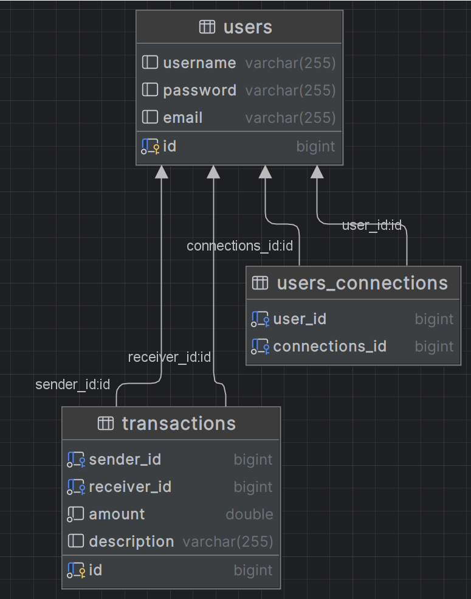

# PayMyBuddy

PayMyBuddy est une application web de transferts d'argents qui permet aux utilisateurs de gérer des paiements entre particuliers.

## Fonctionnalités
- Inscription et authentification des utilisateurs
- Modification du profil de l'utilisateur 
- Gestion des relations utilisateur (ajout, validation, suppression)
- Transactions de paiement entre utilisateurs

## Technologies
- Java 17 : Langage de programmation.
- Spring Boot : Framework Java pour créer des applications web.
- MySQL : Systeme de gestion de base de données relationnelle.
- Marven : Outil de build automatisé.
- Thymeleaf : Moteur de template pour la génération de pages HTML.
- ??? : Framework CSS pour la conception de l'interface utilisateur.
- IntelliJ : IDE
- JUnit 5 et Mickito : pour les tests
- Surefire et JaCoCo : pour l'exécution des tests 
- Log4J pour la gestion des logs 

## Installation et exécution 
1- Clonez le repository : git clone 

2- construire le projet : mvn clean install

3-Exécuter l'application : mvn spring-boot:run 

4- l'application sera disponible à l'adresse suivante : http://localhost:8080

5- Créez une base de données MySQL pay_my_buddy et y inséré dans l'ordre les scripts SQL suivants contenus dans le dossier src/main/resources :
- bdd.sql : Création des tables
- data.sql : Insertion des données
- triggers.sql : Création des triggers

6- Configurez la base de données dans src/main/resources/application.properties :
- spring.datasource.url=jdbc:postgresql://localhost:.....
- spring.datasource.username=yourusername
- spring.datasource.password=yourpassword

7- Faire de même avec le fichier src/main/resources/application-test.properties pour les tests.
- exécuter les tests : mvn verify
- le rapport de tests JaCoCo est généré dans le répertoire : 
- le rapport de couverture de code surefire est généré dans le répertoire :
- taux de réussite aux tests : 100 %
- couverture globale de test : ...%
- tests via Postman 

8- Documentation 
- la documentation de l'API est générée avec Swagger : http//localhost:8080/ swagger......

## Structure de la base de données
