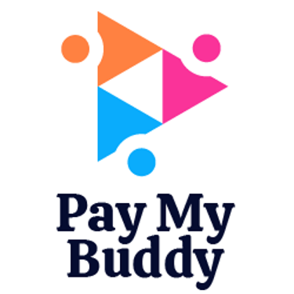
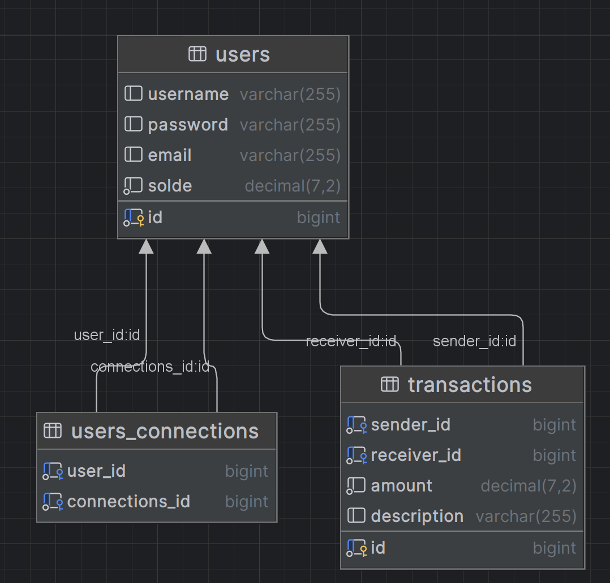

# PayMyBuddy

PayMyBuddy est une application web de transferts d'argents qui permet aux utilisateurs de gérer des paiements entre particuliers.

## Fonctionnalités
- Inscription et authentification des utilisateurs
- Modification du profil de l'utilisateur 
- Gestion des relations utilisateur (ajout, validation, suppression)
- Transactions de paiement entre utilisateurs

## Technologies
- Java 21 : Langage de programmation.
- Spring Boot : Framework Java pour créer des applications web.
- Sprint Security : Framework Java pour la sécurité 
- MySQL : Système de gestion de base de données relationnelle.
- Marven : Outil de build automatisé.
- Thymeleaf : Moteur de template pour la génération de pages HTML.
- JUnit 5 et Mockito : pour les tests
- Surefire et JaCoCo : pour l'exécution des tests 
- Log4J pour la gestion des logs 

## Installation et exécution 
1- Clonez le repository : git clone 

2- construire le projet : mvn clean install

3- Créez une base de données MySQL paymybuddy et y executer le script SQL contenus dans le dossier src/main/resources/db.migration :
- update_schema.sql : Création des tables

4- Configurez la base de données dans src/main/resources/application.properties :
- spring.datasource.url=jdbc:mysql://localhost:3306/paymybuddy
- spring.datasource.username=yourusername
- spring.datasource.password=yourpassword

5-Exécuter l'application : mvn spring-boot:run

6- l'application sera disponible à l'adresse suivante : http://localhost:8080/portail

## Structure de la base de données

## Accessibilité 
1-Accessibilité : Cette application a été développé en suivant les recommandations des WCAG 2.2 (niveau AA), afin de garantir une expérience utilisateur inclusive pour tous les publics, y compris les personnes en situation de handicap. 

2- Principes respectés : 
- **Perceptibilité** : Textes alternatifs pour les images, contrastes suffisants, hiérarchie des titres.
- **Utilisabilité** : Navigation accessible au clavier, focus visible, intéractions cohérentes.
- **Compréhensibilité** : Libellés explicites pour les champs, messages d'erreurs compréhensibles.
- **Robustesse** : Code HTML/CSS conforme, sémantique, compatibilité avec les lecteurs d'écran. 

Des tests ont été réalisés avec WAVE pour valider l'accessibilité de l'interface. Le développement respecte également les bonnes pratiques d'ergonomie et de navigabilité pour améliorer l'expérience utilisateur. 
L'objectif est de rendre cette application conforme aux bonnes pratiques de design inclusif dès la phase de prototype. 